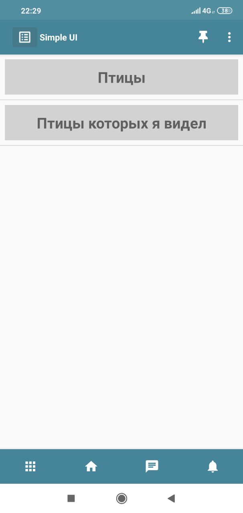
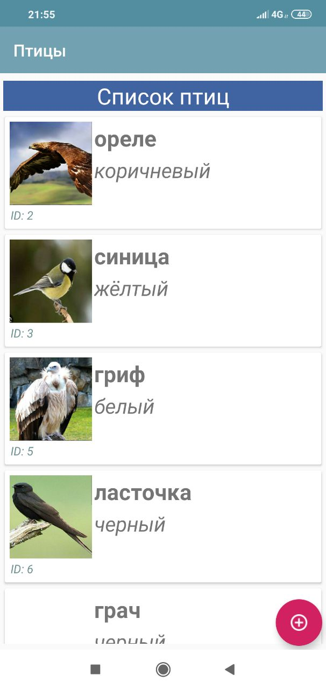
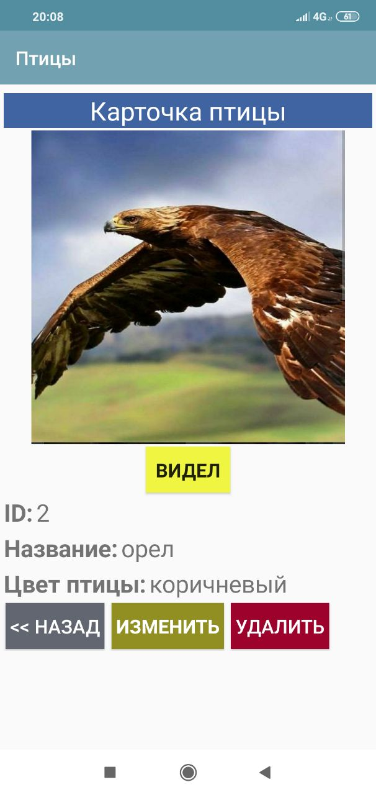
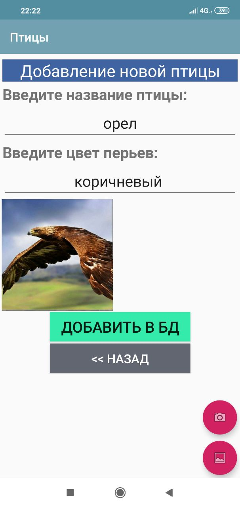
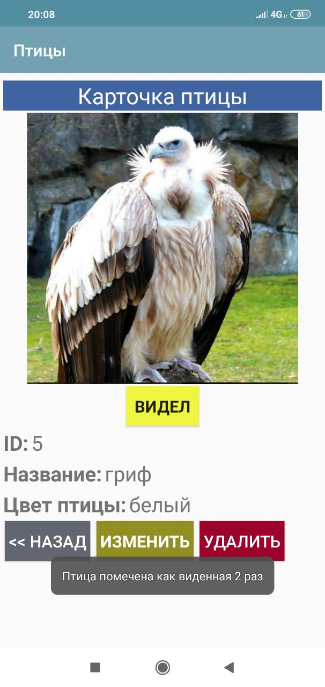
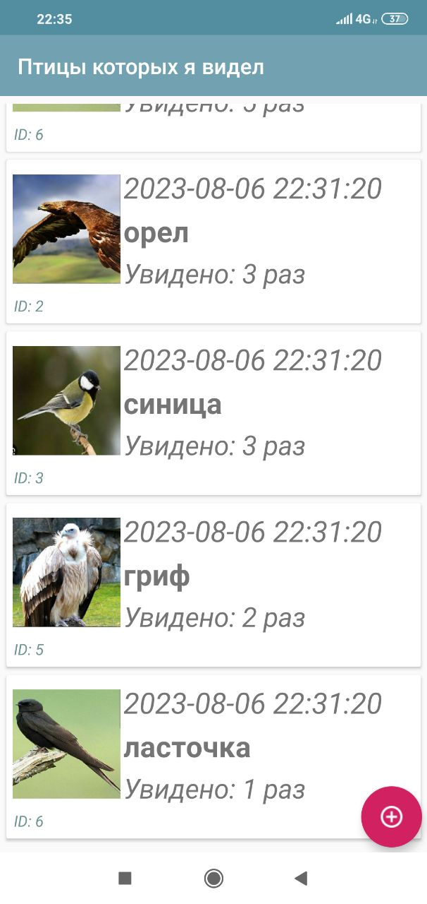

# Описание задачи

Используя инструменты платформы:
- [Ссылка на архив Yandex Disk](https://disk.yandex.ru/d/IZK7yYF7S77OuA)
- [SimpleUI](http://simpleui.ru/)
- [Документация](https://uitxt.readthedocs.io/ru/latest/)

Подробнее:
- [Общее описание](https://uitxt.readthedocs.io/ru/latest/common_functions.html)
- [Создание структуры БД в мобильной части](https://uitxt.readthedocs.io/ru/latest/no_sql.html)

## Задача 1

### Состав конфигурации:

1. Процесс «Птицы».
    - Список птиц: отображается список сохраненных данных в БД приложения.
    - Карточка птицы: отображает на экране конкретный набор данных.
    - Создание новой птицы: экран позволяет ввести новое название птицы и указать цвет перьев.

### Дополнительно:

1. При создании птицы сохранить фото из галереи или камеры устройства.
    1.1. Для отображения списка птиц использовать [кастомные списки](https://uitxt.readthedocs.io/ru/latest/common_functions.html?highlight=%D0%BA%D0%B0%D1%80%D1%82%D0%BE%D1%87%D0%BA%D0%B8#id3).

2. Добавить процесс «Птицы которых я видел».
    - Юзер кейс: В списке птиц выбирается карточка птицы, которую увидел пользователь. Пользователь переходит к самой карточке и может нажать на кнопку «Видел». Идентификатор объекта сохраняется в глобальной переменной. После этого пользователь переходит в раздел «Птицы которых я видел», нажимает на кнопку «+». Из глобальной переменной получается ИД объекта, автоматически создается запись с:
        - Текущее время и дата.
        - Название птицы из БД.
        - Фото птицы из БД.
        - Количество актов видения птицы на момент создания записи.

# Реализация
1. Для разработки использовал последнюю версию комплекта разработчика:
    - [КомплектРазработчикаSimpleUI_Июнь2023_патч_suip](https://disk.yandex.ru/d/R0L4Uo4LtrDFGA)
    - там же в архиве есть .apk файл для установки мобильной платформы на смартфон
2. Реализовал все пункты тестового задания + дополнительно добавил функции:
    - редактирование записи в БД птиц
    - удаление записи из БД птиц
3. Скриншоты итогово проекта в мобильном приложении:
 

